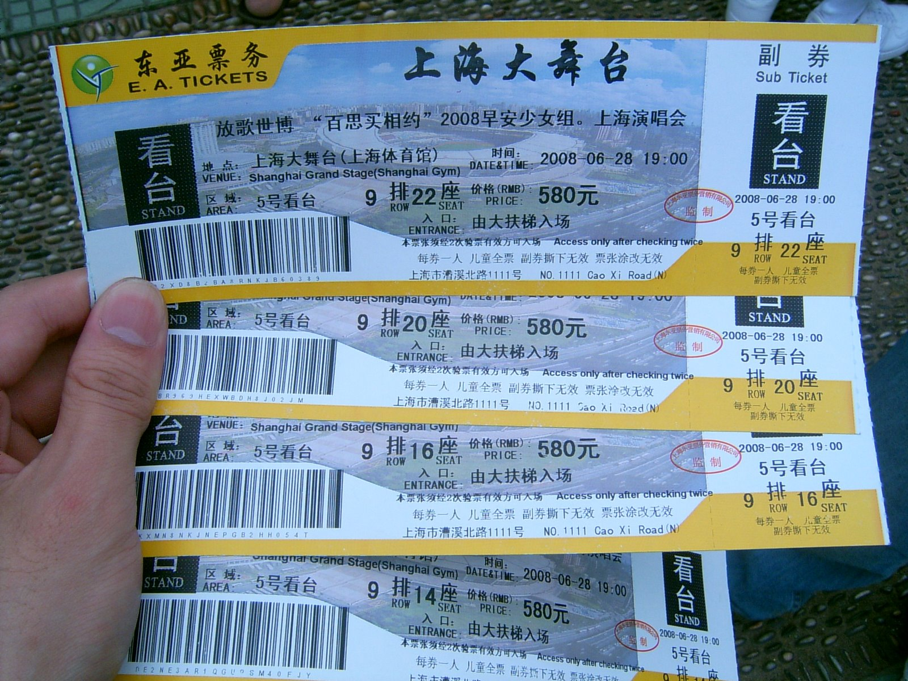
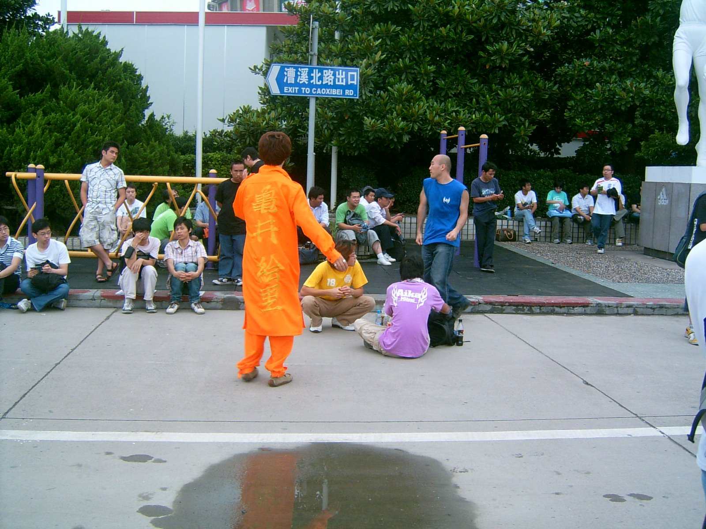
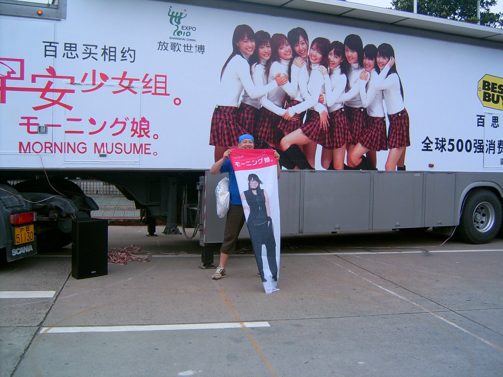
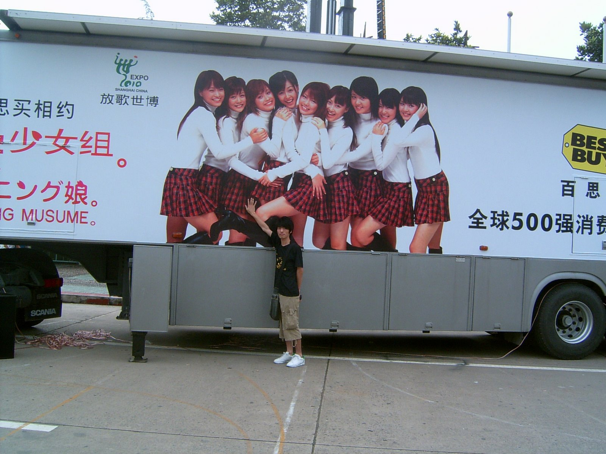

# 归来

- pubdate: 2008-06-29

--------------------------

演唱会归来

一句话，真是太HIGH了！！！！！！！！！！！！！

我还是第一次自己买票去看演唱会，这种心情果然是不一样的。喜欢早安已经很久
了，高中就开始听她们的歌，然后断断续续一直到现在。不能说很专业，但也不算
业余了。

这次的行动完全是aki的一句话，一直想着什么时候来中国开演唱会呢，于是aki理
所当然的说，这不是来了么。我竟然不知道！！！于是当天毫不犹豫地就订了票
子。580，还是比较能接受的价格。

于是6.28，和南京的17，md，venessa来到上海大舞台。

我穿了hellofan的应援TEE，还是很醒目的。由于拿票子是三点半，我们早早的去
了。那边已经集合了好多人，一看同是穿应援TEE的，就知道是拿票子的地方。周
围还有linlinclub的和一些小商贩

------------------------------------------
其中有一个小商贩卖的是JAY的板

于是我们说她是不是搞错演唱会了，还令不清

果然半个小时，她收摊走了。。。 = =|||
-------------------------------------------

还有一群日本人，从日本专程来的wota。他们还真是专业，在外面练起舞来，应该
是在为之后的演唱会暖身吧，以后看了才知道他们的专业程度，真是佩服。

不过那群日本人还真是大叔，虽然中国很多自称大叔的，但也不过20出头。但日本
那群wota看着最起码有30多了，而且还是很WS，真是otaku的典范，虽然是萌3D的。

门口停了辆百思买的车，有张早安10周年的海报

于是跑去照相了 = =.

还摸错条腿，差点摸到小春的...

进场后发现票卖出去的不太多，我买的580是二楼靠前的，二楼比较散，三楼几乎
都没多少人。看来这次来上海是赚不到什么钱了，或者赚黄牛的钱吧，笑

场内的比较爽，离的真近，应该能看的很清楚，我现在戴个眼镜也只能看看小小的
人，不过已经很满足了。

这次主要还是来感受气氛的，以前DVD的演唱会看多了，自己亲身感受就是不一
样。我也算全程跟着挥棒的，并且全程跟着喊的，虽然最多只有一个半小时。

而且我是边学前面的wota，边跟着挥棒的，而且很有技巧，每首歌的点都不一样。
有些歌真是挥的太爽了，就跟在台上一样，有很强的互动，怪不得都想来演唱会呢

不过回头看，身后那群人都没荧光棒，二楼也就我们这带在挥棒和喊叫，觉得很
囧，一点都融入不了气氛，果然还是要楼下啊，他们根本就没坐的，都站着，还能跳呢

今天我爱酱叫的最多，而且很兴奋，叫的好大声，前面的女声频频转过来看，我也
鄙视她，明显伪饭，还跟男朋友亲热呢。17说他们就是来看纯琳的，其他估计都不
认识，明显的爱国人士

今天回来感觉嗓子有点哑了，不过还是不过瘾

--------------------------------------------
曲子主要是每张单曲的主打，基本都唱了，不过是串着唱的，不是很过瘾

爱酱，兔子，豆子，eri，reina都solo了，原以为小春也会solo的，唱那个我听着
很烦的chance

不过这次主要是针对那张10周年的专辑吧，最近在中国发行，所以应该不会唱别的歌
--------------------------------------------

MM们自我介绍太囧了，因为在中国，都要说中文

纯琳当然没所谓啦，可惜苦了其余的姑娘们

我宁愿说日文嘛，我也听得懂，而且大家都说得很激情呢

说中文后，就简单几句了事，sayu，eri都没怎么说

最后最囧的是，唱了首世博的歌，还有捐钱给四川灾民

出来后就想下次一定要买1300的，要买内场前排的

不知道下次要到什么时候，纯君想要发展海外，但愿能加快速度，最好把B团和C团
都带来

哈哈，那就完美了
