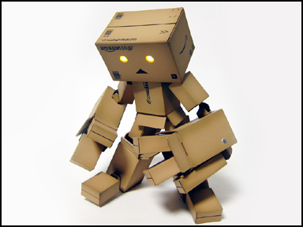

# 可爱的小东西

- date: 2008-12-25

--------------------------

ダンボー（danbo）最早出现在漫画《よつばと！》，是一个由硬板纸箱制成的机器人。之后作者将其[实体化](http://azumakiyohiko.com/archives/2006/05/16_2040.php)，真的用硬板纸箱做了个样子。之后各地爱好者都做了自己的danbo，有大的，[有小的](http://blog.livedoor.jp/tsubuanco/archives/50631843.html)，还有人做了个[五合一体](http://members9.tsukaeru.net/ty1_toys/sakuhin/DANBOARD.htm)，真是赞。

以上制作的都是同人，之后[海洋堂正式出售danbo](http://www.amazon.co.jp/%E6%B5%B7%E6%B4%8B%E5%A0%82-%E3%83%AA%E3%83%9C%E3%83%AB%E3%83%86%E3%83%83%E3%82%AF-%E3%83%80%E3%83%B3%E3%83%9C%E3%83%BC/dp/B000WF1TKS)，使得danbo的fans越来越多，也制作出各种有意思的图片和视频。我是被这张照片吸引的，也可以说拍的好，小danbo一个人低着头，静静地站着，被雨淋的样子，很是让人怜爱。更多的照片可以去[flickr的小组](http://www.flickr.com/groups/revoltech-danboard/)。

最后献上一段danbo参与的[团舞](http://jp.youtube.com/watch?v=2VLs7tfPTJA)。

