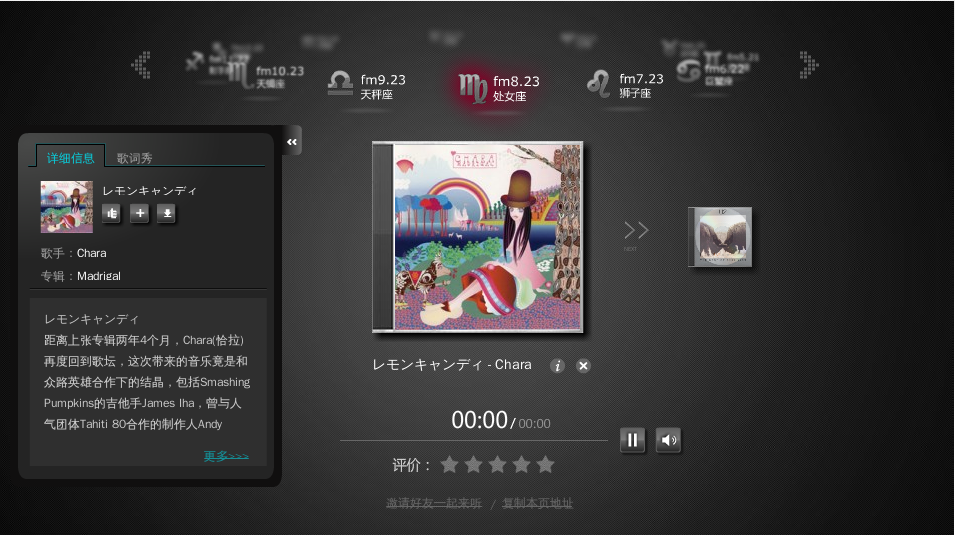

# 虾米星座电台上线

- date: 2009-01-09

--------------------------

[cref 129 虾米]是一个很有特色的音乐网站，自上次的[cref 133 beta版]上线后，最近又发布了[星座电台](http://www.xiami.com/fm/astro)。界面设计的很炫，进入电台后虾米会根据用户填写的星座转到响应的星座频道。左边有专辑的详细信息和歌词，中间是播放的歌曲，还有预先载入的后一首歌，用户也可以评价和分享这首歌。

据[虾米的人](http://www.xiami.com/group/thread-detail/tid/4208)说，“星座电台所推荐的歌曲来自与您同星座用户的推荐和高评分行为”。也就是说，各个星座频道里的歌都出自于该星座的用户对歌的评价，虽然说这个东西挺好玩的，但不是很实用。相较[cref 143 Lastfm]的电台，星座电台则更加的泛化，同一个星座不一定有相同的兴趣，听的歌自然就不同。把星座电台当成一个随机听歌的电台，分一下星座是为了招揽不同星座的人，其实质是一样的。

星座电台可能是一道小菜，更加期待好友电台，不过没好友怎么办？虾米还有一个“[下一个虾米FM电台，由你设计！](http://www.xiami.com/group/thread-detail/tid/4209)”的活动，有什么想法可以去提提。我还是喜欢last的电台。

