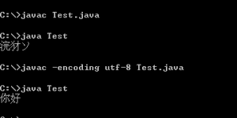

# 一次请求过程中的编码问题

- date: 2009-03-20

--------------------------

很多人在打开网页的时候总为那几秒钟的等待抱怨不已，而有些开放人员却为这一过程头痛不已。尤其是中文开发，有时出现乱码完全不知道什么地方错了，就在这十几秒的过程中竟做了这么多事。这片文章主要讨论在这一过程中的各个编码阶段，以及他们的作用。

### (X)HTML

<strong><?xml version="1.0" encoding="UTF-8" ?>
</strong>

用XHTML的朋友可能会在页面的头一行看到上面的标记，这是XML文件的声明。如果服务器返回的ContentType是application/xhtml+xml，则浏览器就会用XML解析器来解析返回的文本，返回的XHTML被当成了一个XML文档，所以encoding就是告诉浏览器文档所用的是什么编码，浏览器会根据这个编码来显示。因为XML解析器[默认支持UTF-8或UTF-16](http://www.w3.org/TR/2000/REC-xml-20001006#charencoding)，所以如果文档是UTF-8或UTF-16编码的，或者在HTTP头定义编码，则可以[忽略encoding属性](http://www.w3.org/International/geo/html-tech/tech-character.html#IDAL1RO)。但如果返回是text/html的话，就不能用这个声明，就需要用到meta。

<strong><html xmlns="http://www.w3.org/1999/xhtml" xml:lang="en" lang="en"></strong>

这是HTML文档的根目录，如果是XHTML必须定义xmlns。其实xml:lang和lang不是编码，只是代表该文档用的是某种语言。使用这个属性有利于搜索引擎，有些搜索引擎会根剧语言来分类，这样就可以查询不同语言的信息，还有助于浏览器选择字体等等。对于application/xhtml+xml的XHTML只可用xml:lang，对于HTML使用lang，而对于text/html的XHTML两者都要用。

<strong><meta http-equiv="content-type" content="text/html; charset=UTF-8" /></strong>

如果服务器返回的ContentType返回的是text/html（这就是一般的HTML的MIME类型），则就要在head标签中间加入以上这个meta标签，这与上面XML声明有相同的功能，但[两者不能共存](http://www.webreference.com/authoring/xhtml/coding/)。因为XML声明必须是application/xhtml+xml，而meta中的contentType是text/html，两者有冲突。这个标签告诉浏览器正常的显示文档的编码，聪明的浏览器就会自动选择相应的编码。但如果该标签的编码与真实编码不符也会造成乱码，这时可以手动设置（各浏览器有所不同，一般叫做字符编码）。但meta标签也有[失效的时候](http://jiwai.de/popomore/statuses/15907132)。

### URL

**地址栏**

现在大部分浏览器的地址栏都支持UTF-8（参见[rfc2396第2部分](http://www.ietf.org/rfc/rfc2396.txt)），也就是说如果你在地址栏输入中文，那么浏览器会自动编码成UTF-8。而且大部分浏览器能显示UTF-8编码，在地址栏显示的是字符而不是百分号后加两个十六进制数。

**链接**

网页上最常见的就是链接，链接的编码跟标签本身没有太大关系，而与标签的href属性有关，就是需要转向的某个链接。该链接的编码已经在文档渲染的时候确定了（根据META标签中的编码），如果出现乱码那么转到该页面后，地址栏出现的也是乱码，因为不支持其他编码，但是可以写成百分号加两个十六进制数。

**表单**

根据网页的默认编码，一般由META设置，表单提交后就是按照现有编码转换的（无论GET还是POST）。使用表单应该注意编码不同的情况，比如一个网页META编码设的gb2312，而URL和请求字符串中都包含中文，那么URL按照UTF-8编码，字符串按照gb2312编码，服务器却无法响应两种编码，肯定会造成乱码。所以编码最好不要混用，而且URL最好不要包含中文。也可以手动设置，比如原来的META设置的UTF-8，现在把他手动设置成gb2312，那么表单发送的就是gb2312编码后的链接。

**JavaScript**

js有几个常用的编码函数escape，encodeURL，encodeURIComponent()，这些函数都是对URL进行编码的，但忽略一些如“&”，“-”这样的特定字符，但这[三个函数还是存在区别的](http://looxiaohu.javaeye.com/blog/220334)。如果使用ajax建议先将URL编码后再发送。

### JSP

<strong><%@page language="java" contentType="text/html; charset=UTF-8" pageEncoding="UTF-8"%></strong>

总所周知JSP最后都要编译成servlet，这个工作是交给服务器的。服务器将jsp文件转换成servlet文件，然后再进行编译。pageEncoding就是在转换的过程中起作用的，他是用来指定读取文件的编码的（和jsp文件编码相匹配），据说[生成的都是UTF-8编码的](http://tech.sina.com.cn/s/2007-09-27/10121766102.shtml)，这个我没有查到。如果不指定pageEncoding，则默认编码为 ISO-8859-1。如果没指定pageEncoding而contentType存在，则使用contentType的编码。

标签中的contentType是用来指定返回的HTML文档的编码和MIME类型，服务器会将其加在HTTP的相应头上告诉浏览器文档的编码，此与servlet的如下函数相似。

response.setContentType ("text/html;charset=utf-8");

**JVM**

java虚拟机[处理数据是由unicode编码](http://publib.boulder.ibm.com/infocenter/iseries/v5r3/index.jsp?topic=/rzaha/charenc.htm)，但考虑到兼容性必须支持其他编码。所以有一个file.encoding属性（可以通过System.getProperty("file.encoding")获得），该属性的默认值是依赖于系统的编码（如果是中文windows可能是GBK），也可以手动设置他。在读取数据时由file.encoding指定的编码转换成unicode，在输出数据时再由unicode转换成file.encoding指定的编码。用javac编译.java文档的时候也是相同的原理，读入.java文档按照file.encoding指定的编码转换成unicode，输出.class再转换成file.encoding指定的编码。

public class Test {
    public static void main(String[] args) {
        System.out.println("你好");
    }
}

如以上代码，将其保存成UTF-8编码的Test.java。我的系统使用的是中文windows，所以file.encoding属性为GBK。在用javac编译的时候Test.java是按照GBK编码转换成unicode的，然后输出GBK编码的Test.class文件。运行该文件出现了乱码，这是肯定的。那为什么没有报错，因为GBK和UTF-8都是向下兼容ASCII的（其实挺郁闷的，认错编码而不报错），所以只有“你好”两个字是不对的，可以通过编译。因为GBK是由两个字节组成，而UTF-8要有三个，所以最后出现的乱码是三个字的。如果需要指定编码只要加一个-encoding参数（如下图），javac就会根据UTF-8来编码了，结果不会产生乱码。

<a href="../../uploads/2009/03/encoding.png"></img></a>

不要用eclipse等IDE来测试上述代码，虽然eclipse默认使用的是jvm的默认编码，但一旦你是指定了编码，eclipse就会根据指定的编码来编译。

**Server**

服务器会接受浏览器传来的请求，并解码请求字符串。URL的编码上面已经说过了，服务器需要对已经编过码的URL进行解码，所以服务器必须指定该URL的编码类型，这两者必须匹配才不会造成乱码。比如服务器是tomcat，URL编码成UTF-8后发送到tomcat，tomcat也需要用UTF-8进行解码，只添加URIEncoding属性设定为UTF-8，如不设定默认为ISO-8859-1。

<Connector port="8080" URIEncoding="UTF-8"/>

### HTTP

**Content-Type**

[HTTP响应报头中带的参数](http://www.w3.org/International/O-HTTP-charset)，可根据jsp中的pageEncoding属性和servlet中的`setContentType方法`来设定，让浏览器知道返回的文档是什么编码。

**与META的冲突**

HTTP和META中的`ContentType作用是相似的，但[HTTP具有优先权](http://www.w3.org/International/tutorials/tutorial-char-enc/en/slides/Slide0380.html)，如果HTTP没有指定``ContentType，浏览器就会读取META的``ContentType。建议两个都要设置，因为如果保存成本地文件，那么HTTP就不起作用，如果没有设置META，浏览器就只能猜测文档的编码。`

### 流程

之前说了各个阶段的编码问题，现在把它们串起来说说整个流程。拿UTF-8来说明，

1. 浏览器最后总是发送一个请求给服务器，所以在发送HTTP请求之前所有的编码工作都在浏览器完成，不管是直接在地址栏输入，链接、表单提交还是用ajax（上面都已提到），将数据编码成UTF-8。

2. 服务器接收这个请求，将数据按UTF-8解码，转发给相应的jsp或servlet。

3. 如果jsp没编译，则按照UTF-8编译成servlet，运行servlet生成(X)HTML文档，设定META编码为UTF-8。

4. HTTP响应头设定contentType为UTF-8，将文档发送到服务器。

5. 浏览器接收响应，按照HTTP的contentType的编码进行显示。

最后，这只是说明了一次HTTP请求过程中的编码问题，并没有设计到数据库的编码转换，可以看看[这个UTF-8建设全站](http://fwso.cn/blog/?p=511)。关于JSP编译的编码转换还是有点不明白，之后再修改，有错的地方请各位批评指正。[有问题的可以找我探讨](http://chuo.me/2008/11/my-social-network/)。
