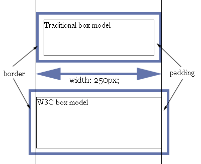

# CSS中的top和left

- pubdate: 2009-03-29

--------------------------

在编写CSS中如果总是设计到定位，那么肯定会用到top left，当然还有两个right和bottom。经常用到的人会觉得这两个属性很简单没必要谈，但我还是来说说我的心得。

### 关于top和left

这四个属性是设置一个偏移量，对于特定容器的一个偏移。top是指元素的顶边相对于容器的顶边的偏移，right是元素的右边相对于容器的右边的便宜，但方向是从右到左。正因为有方向，所以这四个属性也可以设置为负值，是向反方向偏移。也可以设置百分比，这个值是相对于容器计算出来的，比如top:50%，就是容器的width*50%。

### 和position的关系

这四个属性必须与position共同使用，不然就没有效果，position值为static时这四个属性也是无效的。position还存在其他三个值absolute，relative，fixed，fixed和absolute类似，所以最大的区别还是absolute和relative。absolute是相对于根容器偏移，而relative是相对于父级容器偏移。

### 和盒式模型的关系

CSS中定义了一个盒式模型，关于这个网上有很多文章。主要有margin（外边距），border（边框），padding（内边距）这三个名词，用来设置这个盒子的空隙。W3C定义的盒式模型定义的width和height是指内容实体的，而不包括margin，border和padding，而传统的盒式模型则不同，他的width是包括border和padding，可以看下图帮助理解。

但值得庆幸的是只有IE在quirks  mode才会使用传统的模型，其他都使用的是W3C的模型。但这两种模型两种好呢？[ppk曾经说过](http://www.quirksmode.org/css/box.html)，

> 随便拿一个真正的盒子，把一样比盒子小的东西放进去。问任何人这个盒子的宽度（width），他会从盒子的外边开始量起，没人回去量里面的东西。

按他这种说法，传统的盒式模型更接近人的感觉。但对于开发者来说W3C的更加好判断，我可不想内容的大小跟着边框和内边距变化。

说了这么多盒式模型，那么和top和left有什么关系？那么你觉得这四个属性所说的元素的边缘是margin，border还是padding呢？W3C模型告诉我们，偏移值指的是容器的内容实体到元素外边距的距离，就算说topleft定义的盒子左上角的坐标是margin-top和margin-left的交点，当然这个坐标是相对于容器来说的，传统模型也是如此。

回头看了一眼，写的乱不说，还有些偏题，可能topleft真的没什么说的吧。
