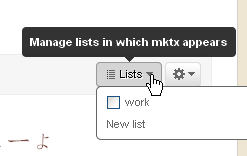

# twitter推出新功能lists

- date: 2009-10-30

--------------------------

今天用twhirl的时候感觉速度很忙，所以索性上twitter的网站逛逛，果然上天眷顾好心人，顶上告诉我你可以建一个list。

粗一看还以为是将我的推分分类，可以把愤青的话和技术的话分分开，免得引起误会，但是我的理解错的，twitter管理的不是推而是人。听某些同学说不是所有的人都有这个功能，看来被我撞到了。

## 新建

在twitter侧栏会多出list一项，其中会显示list，这里应该不会显示所有的，因为下面有view all，还有不知道是按什么顺序排列的。从这里新建一个list，现在也可以在刚才发图的地方新建。

## 添加

list被创建后就可以添加人了，在用户页面或者搜索结果的页面都会显示一个lists的widget，可以通过这个widget把用户加入到list中，从这种形式来看可以添加到多个list中。list中几乎能加所有的人，除了protected的，这就好比一个精简的public_timeline。

## 查看

任何人都可以查看这个公开链接，https://twitter.com/popomore/work，除非被设为私有。在这个页面可以显示所有的被添加的成员，以及所有的订阅者。

## 订阅

list创建后，任何人都可以订阅这个list，那么所有被添加到list中成员的推都会出现在这里。不过list不会出现在home中，来看第三方需要忙活一阵了。

## 干什么的？管理人？

那这个list是干什么的呢？看起来很像IM的群组 ，分门别类的把好友管理起来。不过别忘了，list中添加的不只是好友，也不只是following的，可以添加任何人。list就像一个精简的public_timeline，以前public_timeline的内容太过于繁杂，没有正对性，现在list就靠人为的来筛选，构成对某一方面用户有用的信息组。不过这种显示方式并不是那么的方便，我需要去每一个list查看，不知道有没有更好的方法。

list很好玩，让我们来挖掘它的价值吧。
