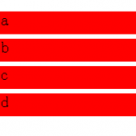

# li内block元素设置absolute的3像素bug

- pubdate: 2010-06-23

--------------------------


li float后的3px bug还挺常见，但是这个倒是第一次。

dom结构如下

```
<ul class="demo1">
  <li><a>aaa</a></li>
  <li><a>bbb</a></li>
  <li><a>ccc</a></li>
  <li><a>ddd</a></li>
</ul>
```

css如下

```
ul{width:200px;}
ul li{height:30px;background-color:red;list-style:none;margin:0;padding:0;position:relative;width:100%;}
ul li a{display:block;width:100%;height:100%;}
```

在a上设[cci lang="css"]position:absolute;[/cci]，就会出现3px问题，如下图。

[](../../uploads/2010/06/screen-capture-2.png)

我设absolute是为了离开li这个容器，是某方面的需求。解决方法竟然惊人的相似，在li上设一个float。

[demo在此处](http://chuo.me/demo/li-3px-space.htm)

update　2010.06.25
还可以在li上设置 `vertical-align:bottom`
thx 异草
