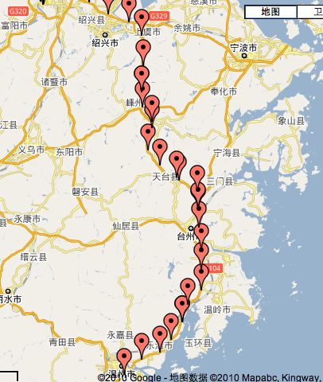
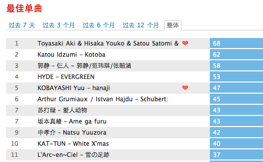
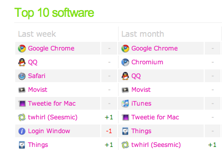

# Track

- date: 2010-07-23

--------------------------

人总有健忘的毛病，有些事过一段时间就会忘记。我们无法逆转自然规律，但是可以通过一些工具来避免这种事情发生。

## Track you position - [谷歌纵横](http://www.google.com/intl/en_us/latitude/intro.html)

这是我非常喜欢的google服务之一，他可以通过GPS获取你当前所在的坐标并显示在地图上，并且可以导航。最令我惊讶的是所以的这些数据都会保存在服务器上，你可以回头看看你的行走轨迹，如下图是我端午去厦门的时候途经浙江的线路。当然你如果不想让别人知道的话，可以设置权限，如果你都不想让google知道你在哪，那还是放弃这个服务吧。

支持大部分手机客户端android,iphone,wm,bb,s60

## Track your idea - [twitter](https://twitter.com/)

每个人都有唠叨和抱怨的时候，也有灵光一闪的时候，这个时候你需要把他记录下来，不然很快这些想法就会自己消失。每个人使用微博的方式都不同，关于这一点我之前有提过「[[微博何必狡兔三窟]]」。我使用微博的目的主要是记录自己每个时段的所思所想和生活状态，当然包括一些八卦，几年后回过头去看看自己说的那些话，可能很幼稚，也可能会羡慕那个时候的自己。前段时间[叽歪提供了一本纪念册](http://jiwai.de/)，将以前所有记录打印成册，非常有纪念价值。

在墙内可以用[腾讯微博](http://t.qq.com/)和[新浪微博](http://t.sina.com.cn/)

## Track your music - [last.fm](http://last.fm)

平时都使用itune来管理音乐，能够记录听歌的频度、给歌曲打分之类的，但是展示方面并不强大。并且itune始终是一个桌面应用，无法适应多种应用场景。我使用last.fm就因为他开放的api，也就是说只要想，任何软件都可以集成last.fm。使用last.fm，可以记录你用任何设备听的音乐，会按时间段进行统计，并且会给出相应的推荐。我是mac用户，同步itune的last.fm的插件会比较多，所以比较方便，手机android也有相应的插件。

国内可以用[虾米的服务](http://www.xiami.com/software/xiamifm)，虽然记录的功能还比较弱。

## Track your software - [wakoopa](http://wakoopa.com)

你知道曾经使用过哪些软件么，知道哪些使用频率最高么。我用wakoopa来记录我的软件使用情况，wakoopa是跨平台的，所以不用担心无法使用的情况。在wakoopa上还能去找一些新奇的软件去试用，这是一件好玩的事。

