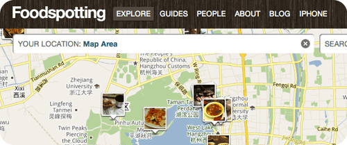

# 美食分享应用foodspotting

- date: 2010-12-13

--------------------------

当我们玩twitter的时候他们还在玩博客，当我们玩4sq的时候他们还在玩微博，现在他们也玩LBS了，那我们玩什么。

最近在app store里找到一个好玩的东西——[foodspotting](http://www.foodspotting.com/)，手机控和同步控们又有的玩了。foodspotting的切入点是美食，分享“在某时某地吃到什么好东东”，而且还有清晰无码图片，晚上看得口水都下来了。

foodespotting还有一个好玩的东西就是guides，类似gowalla的trips。可以自己制作一个美食的行程，比如杭州小吃，将想去的地方都添加上去，类似一个向导的功能。如果其他人完成你这个行程就可以得到一块奖牌，这种可以当作一个todo list，而且更具游戏性，很吸引人。

玩twitter是为了分享自己做什么想什么，玩4sq为了分享自己在哪里，而foodspotting则是把具体做什么细分到吃上面，而且是美食，这是他的切入点。从这个切入点下去就可以做很多文章。我猜想接下来会有很多垂直应用，就像前阵子热炒的SNS一样，然后通过twitter，facebook的人际关系网来增加自己的用户群。
