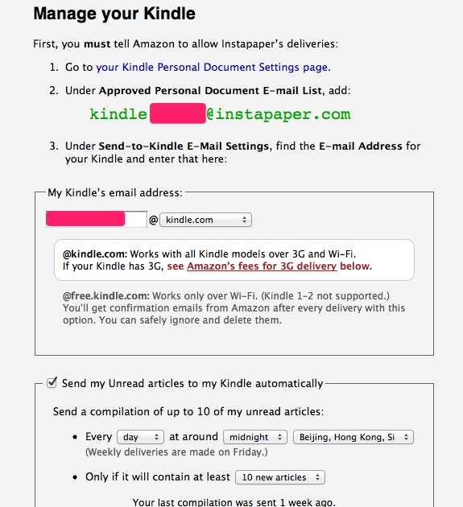

# 入手kindle4

- date: 2012-01-31

--------------------------

[](../../uploads/2012/01/6e12431fjw1dpc9wt7y6hj.jpg)

其实已经入手kindle4一段时间了，用起来还不错，小巧便携，只是没有背光还不太适应。我是直接root的，root的目的是换个字体和背景，今天翻了下[多看已经支持kindle4](http://bbs.duokan.com/forum/thread-54551-1-1.html)了。

## root权限

### 1. 获取密码

在 kindle 上选择 settings，在最下面可以看到 kindle 的版本。如果是4.0，密码为mario。如果是4.0.1需要通过下面方式获取

在版本上方找到 Serial Number，创建一个 python 文件，内容如下，序列号输入刚刚找到那个值。

```
#!/usr/bin/env python
import hashlib
print(“fiona%s”%hashlib.md5(“这里替换为你的设备序列号\n”.encode(‘utf-8′)).hexdigest()[7:11])
```

可以直接到这个网站 http://members.ping.de/~sven/kindle.html

### 2. 进入调试模式

usb链接上kindle，在根目录创建名为ENABLE_DIAGS的文件，windows下要注意不要后缀名。重启kindle（Settings -> Menu -> Restart）

重启后kindle进入调试模式，选择Misc individual diagnostics -> Utilities -> Enable USBnet，按右方向键(FW RIGHT)

### 3. ssh链接kindle

在此期间usb是一直插着的，设置你的本地网络ip为192.168.15.1，子网掩码为：255.255.255.0。使用putty或其他ssh工具登录到192.168.15.244。账户名为root，密码使用上面获取的。

```
ssh root@192.168.15.244
```

### 4. 挂载

因为kindle分了几个区，所以要挂载/mnt/base-mmc，之后要用到

```
mount /dev/mmcblk0p1 /mnt/base-mmc
```

### 5. 复制ssh server

之后wifi也可以用ssh链接

```
cp -r /usr/local /mnt/base-mmc/usr/
sync
```

修改防火墙规则，开启ssh访问

```
echo "-A INPUT -i wlan0 -p tcp --dport 22 -j ACCEPT" > /mnt/base-mmc/etc/sysconfig/iptables
```

### 6. 断开链接，重启

返回到主目录，选择Exit, Reboot or Disable Diags > Disable Diagnostics

### 7. wifi链接

kindle重启后可以wifi链接了，首页pc和kindle要在一个局域网内，然后找到kindle的ip（我是在路由器里查的），用ssh链接，账号和密码不变。

## 修改字体

1. 复制字体

usb链接，先把字体考到根目录。wifi链接后将字体复制到指定目录

```
cp /mnt/us/xxx.ttf /usr/java/lib/fonts/
```

如果是linux或mac，可以用scp直接复制

```
scp * root@kindle.ip:/usr/java/lib/fonts/
```

2. 修改字体配置

```
vi /usr/java/lib/font.properties
```

搜索hans，将下面4个设成刚复制的那个字体

```
hans.0=CJK.ttf
hans.plain=CJK.ttf
hans.1=CJK_Bold.ttf
hans.bold=CJK_Bold.ttf
```

## 修改背景

kindle在待机的时候都是广告，我们可以替换成喜欢的图片。

1. 创建背景目录

usb链接，在根目录创建一个screensaver文件夹

2. 备份原有文件

ssh登录到kindle

```
mv /opt/amazon/screen_saver/600x800 /opt/amazon/screen_saver/600x800_bak
```

3. 链接创建的根目录

```
ln -s /mnt/us/screensaver /opt/amazon/screen_saver/600x800
```

4. 去除广告

```
mv /var/local/adunits /var/local/adunits_bak
```


## 读书

kindle支持很多格式，mobi、txt、pdf，唯独不支持epub。我一般都找mobi的，txt排版不是非常好，而且没有章节；pdf要看尺寸，如果尺寸太大放在kindle中看的话会显得特别小，pdf的质量也参差不齐。

激活kindle需要一个amazon的账号，可以直接去[amazon注册](https://kindle.amazon.com/)。amazon有一个推送服务，可以将网络同步的内容通过wifi下载到kindle上。在这之前你需要申请一个kindle.com的邮箱。

### 1. 自动转格式

如果要上传某本书，可以发邮件到 yourname@kindle.com 上。amazon 会自动转换成自己的格式，然后同步到 kindle 中。

### 2. 同步instapaper

如果你在用 instapaper，也可以在 kindle 中阅读。在 [instapaper](http://www.instapaper.com/user/kindle) 配置如下

[](../../uploads/2012/01/111.jpg)

将instapaper的email添加到 [amazon 的 Personal Document E-mail List](https://www.amazon.com/gp/digital/fiona/manage#pdocSettings) 中，这是个白名单。然后设置达到多少数量发送一次，这个最好设大点，不然如果只有一片更新，会和其他9篇老的一起打包的。
