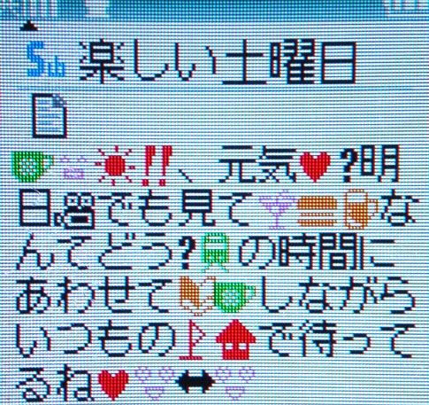
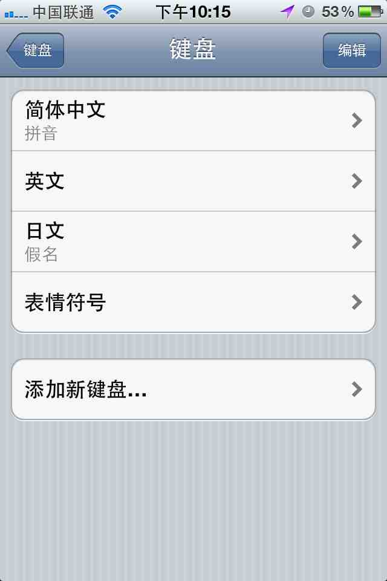
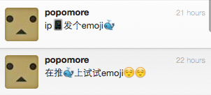
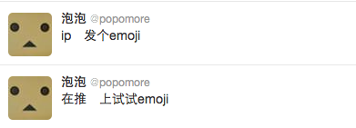

# emoji

- date: 2012-02-01

--------------------------

emoji(絵文字)最早是在日本公司 DoCoMo 的[i-mode](http://en.wikipedia.org/wiki/I-mode)中使用的，从字面理解就是图像(絵)和文字，用图像来表达文字的意思。emoji在日本非常流行，经常看到mm发短信时加了好多可爱表情（上图），经常看日剧应该有此感受。如果是男生给你发可就要小心了哦，亲。

emoji和其他文字一样也有对应的unicode，属于[Private Use Area](http://en.wikipedia.org/wiki/Private_Use_Area)(U+E000 - U+F8FF)。Private Use Area这块区域没有标准的定义，各个公司和组织都能自行使用。举个最常见的例子，(U+F8FF)在mac字体中显示为苹果logo，而在其他地方会显示为其他图案或无法显示。emoji 的 unicode 也存在这种问题，日本的三家公司都制定了自己的标准，他们对应的 unicode 各不相同。

- [Docomo emoji](http://www.nttdocomo.co.jp/english/service/developer/make/content/pictograph/)
- [KDDI AU emoji](http://www.au.kddi.com/ezfactory/tec/spec/3.html)
- [Softbank emoji](http://creation.mb.softbank.jp/mc/tech/tech_pic/pic_material_1.html)

[iphone也支持emoji](http://barrow.io/posts/iphone-emoji/)，在设置中选择通用->键盘->国际键盘->添加新键盘->表情符号，然后在各种应用中切换输入法就行了。

[Unicode 6.0规范化了emoji](http://www.unicode.org/versions/Unicode6.0.0/)，并添加了更多的表情(U+1F300 - U+1F545)，可以查看[emoji各种unicode的对照表](http://unicode.org/~scherer/emoji4unicode/snapshot/utc.html)。

emoji 的使用也是各不相同，因为系统和浏览器本身并不支持。在 mac 的 twitter 客户端和 iphone 上是能显示的，但浏览器上却无法显示。

新浪微博发送 emoji 会直接转成转换成图片，这个体验比较好。而用 iphone 给 gf 的 android 发短信时，android 直接不显示。

虽然觉得这个很有意思，但是整个要使用起来还是很麻烦的，现在觉得比较靠谱的是在不支持的客户端上都使用图片，其他则直接用 unicode。
