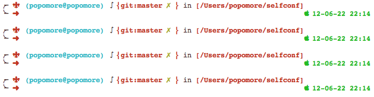

# zsh

- date: 2012-06-23

--------------------------


[](../../uploads/2012/06/屏幕快照-2012-06-22-下午10.14.22.png)

断断续续用了几次 zsh，一直没用起来，这次用的时候好好的看了下文档，自己配置了 [theme](https://github.com/popomore/selfconf/blob/master/zsh/themes/popomore.zsh-theme)，还真乐在其中。 网上有一大堆安装 zsh 和 oh-my-zsh 的博文，[google 一下就知道了](https://www.google.com.hk/search?sugexp=chrome,mod=5&sourceid=chrome&ie=UTF-8&q=oh-my-zsh)。用 zsh 的人很多是因为他长的漂亮，我介绍下如何自定义主题吧。


## 配置主题


在 ~/.zshrc 配置主题，我自定义的样式叫 popomore

```
ZSH_THEME="popomore"
```

在 ~/.oh-my-zsh/themes 添加样式文件 popomore.zsh-theme。终端的展现是通过 PROMPT 设置的，如果想在右边展现可设置 RPROMPT。下面是 PROMPT 的可选值

```
General
%n The username
%m The computer's hostname(truncated to the first period)
%M The computer's hostname
%l The current tty
%? The return code of the last-run application.
%# The prompt based on user privileges
Times
%T System time(HH:MM)
%* System time(HH:MM:SS)
%D System date(YY-MM-DD)
Directories
%~ The current working directory.
If you are in you are in your $HOME, this will be replaced by ~.
%d The current working directory.
```

`PROMPT='%n@%m'` 会输出你的用户名和机器名：

如果想让光标换行，在设置 PROMPT 的时候直接换行就可以了

```
PROMPT='%n@%m
'
```


## 配置颜色


颜色可以用 fg（加粗可以用 fg_bold） 来调用，比如用户名设置红色 `PROMPT='%{$fg[red]%}%n'`

%{...%} 是指不输出内容，因为是设置颜色，所以不用输出。

有时候需要重置颜色

```
PROMPT='(%{$fg[red]%}%n%{$reset_color%})'
```

上面只有用户名为红色，括号为默认色。reset_color 用来重设颜色的，一旦设置了某个颜色，后面都会是这个颜色，所以要在某个位置去重置颜色。


## 配置插件


oh-my-zsh 的插件存放在 ~/.oh-my-zsh/plugins 下，里面有很多插件，扫了圈发现能用的并不多。 在 ~/.zshrc 配置 git 插件

```
plugins=(git)
```

git 插件有个好处，能告诉你很多 git 的信息，比如在哪个分支，是否没提交。

```
ZSH_THEME_GIT_PROMPT_PREFIX="  %{$fg_bold[red]%}git:"
ZSH_THEME_GIT_PROMPT_SUFFIX=""
ZSH_THEME_GIT_PROMPT_DIRTY="%{$reset_color%} %{$fg[yellow]%}✗%{$reset_color%} %{$fg_bold[red]%}%{$reset_color%}%"
ZSH_THEME_GIT_PROMPT_CLEAN="%{$reset_color%} %{$fg[green]%}✔%{$reset_color%} %{$fg_bold[red]%}%{$reset_color%}%"
```
