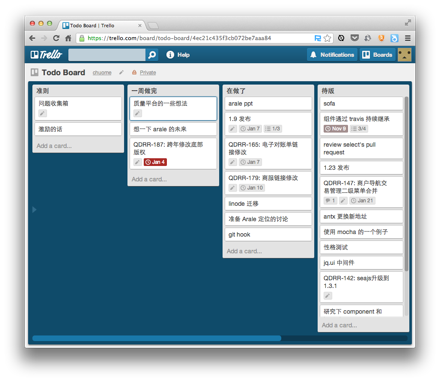

# 使用 trello 做 todo 工具

- date: 2013-01-05

--------------------------

[Trello](https://trello.com/) 是一个很神奇的工具，项目经理拿它作为项目管理的工具，SQA 拿它作为项目流程的工具，也有人用来作为对外宣传的入口，当然你也可以用来写博客。

看看 trello 自己是怎么使用的 => [任意门](https://trello.com/board/trello-development/4d5ea62fd76aa1136000000c)

但我这里介绍的是另一种用法，todo 工具。GTD 这个词已经不那么流行了，不知道是已经深入人心还是大家都放弃它了。我已经使用了很多 GTD 的工具，最后发现**工具都是浮云，贵在坚持**，但我今天还是要说下工具。

## Trello 的几个概念

### Board

Board 是展现的一个面板，两个以上的 board 不能同时显示，Board 可以是一个项目、一个组织、一个产品等等。

### Card

Card 是最小的单元，可以在多个 board 或多个 list 之间任意移动。

### List

List 介于 board 和 card 之间，一个 board 包含多个 list，一个 list 包含多个 card。

## 如何使用

接下来介绍一下我怎么使用 trello，首先新建一个 todo board，新建三个 list 「一周内已完成」「正在做」「待办」对应于 `todo` `doing` `done`。

在使用过程中有下面几条原则

- 每个 todo 项为一个 card，可以设置预期时间，添加描述和 checklist 等等，card 完全能满足 todo 项的功能。
- 新增 todo 添加到「待办」中。
- 开始做某个 todo 时移动到「正在做」。
- 完成后移动到「一周内已完成」。

  为什么叫「一周内已完成」呢，因为长时间使用这里会囤积一堆的 card，不美观也不利于整理。所以我这里存放的是一周完成 todo，在写周报的时候正好 review 一下一周所做的事情。这是这个 todo board 的关键，因为 **todo 只有整理和回顾才能发挥作用**。
  
- 一周结束会把这些 card 都隐藏（archive）。
- 除此之外还可以使用 label，可以当作分类或状态。比如某个 todo hold 了，你添加一个 hold 的 label。

## 工具

如果你还使用 github 或 jira，那我推荐一个工具 [Trello-Bookmarklet](https://github.com/danlec/Trello-Bookmarklet)，你一定会觉得很棒。

通过这个 bookmark，你可以将 issue 直接同步到 trello 中，是不是觉得 todo 做起来更有意思了。

## 结论

虽然 trello 的使用方式很简单，但别忘了我之前说的「**工具都是浮云，贵在坚持**」。

最后要说：Trello 的优点还是团队协作，多人使用起来更爽，这只是一个 hack 的玩法。